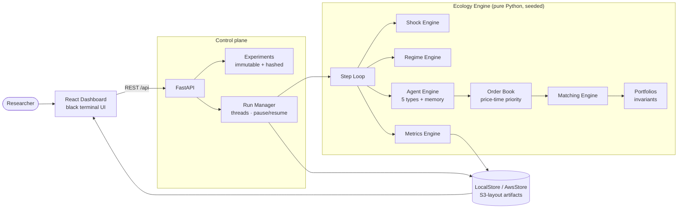

# Tezcat

> **Tezcat is an agent-based market ecology laboratory for studying emergent financial market dynamics through reproducible experiments, controlled shocks, regime-aware agents, and quantitative market metrics.**

Tezcat does not predict markets. It creates artificial markets populated by heterogeneous trading agents, then lets you run controlled experiments on how bubbles, crashes, liquidity crises, and recoveries **emerge** — price is never imposed externally; it arises from order flow through a real limit order book.


*The live run dashboard: emergent flash crash at step 800 (whale sell program → MM withdrawal → panic sentiment), regime bands, live order book ladder, trade tape, and a shock-injection panel.*

## What's inside

| Layer | What it does |
|---|---|
| **Market Engine** | Central limit order book, price-time priority matching, partial fills, tick-snapped prices |
| **Agent Ecology** | 5 agent types: noise, retail (herding/panic), momentum, mean-reversion (fundamental anchor), market maker (inventory-skewed quotes) |
| **Portfolio layer** | Reservation-based accounting: no negative cash/inventory, conservation invariants checked every run |
| **Shock Engine** | Whale order programs, market-maker withdrawal, sentiment shocks — scheduled or injected live via API |
| **Regime Engine** | Stable / Crisis / Recovery detection with hysteresis; regime modifiers change agent behavior |
| **Agent Memory** | Fear/confidence/trend/value beliefs update from experience; losses make agents cautious |
| **Metrics Engine** | Log returns, rolling volatility, spread, depth, drawdown, order imbalance, PnL by strategy, crash & liquidity-crisis detection, HHI |
| **Laboratory** | Experiments (immutable, hashed config) → Runs (seeded, deterministic, reproducible) |
| **REST API** | FastAPI: presets, experiments, runs, live market state, shock injection, reports, exports |
| **Dashboard** | Minimalist Bloomberg-style black terminal UI (React + custom SVG charts) |
| **Cloud** | S3-layout artifact store, DynamoDB adapters, SAM template (API Gateway + Lambda + EventBridge + CloudWatch) |

## Quickstart

```bash
python3 -m venv .venv && .venv/bin/pip install -r requirements.txt
cd frontend && npm install && npm run build && cd ..
.venv/bin/uvicorn tezcat.api.app:app --host 0.0.0.0 --port 8000
# open http://localhost:8000
```

Headless smoke run of all three presets:

```bash
.venv/bin/python scripts/smoke.py
```

Tests (51 passing — unit, integration, simulation validation):

```bash
.venv/bin/python -m pytest tests -q
```

## The three presets

| Preset | What happens |
|---|---|
| **Stable Baseline** | Balanced ecology. Tight spread, low volatility — the control group. |
| **Flash Crash** | At step 800 a whale sell program hits a thin book; market makers withdraw; sentiment turns; retail panics. ~30% drawdown, crisis regime, then a V-shaped recovery as mean-reversion capital buys the dip. |
| **Bubble Formation** | Hype sentiment waves + momentum-heavy ecology push price ~+40%; a reality check deflates it. Momentum/retail profit on the way up, market makers bleed. |

Same seed + same config ⇒ identical run, tick for tick. All figures below are generated
from real deterministic runs by `scripts/make_figures.py`:


### Anatomy of the flash crash

Price, spread, and book depth around the shock chain — regime detection (crisis
bands in red, recovery in green) reacts purely to emergent market stress:


### Who paid for it

The report attributes PnL by strategy. Panic-selling retail transfers wealth to
the mean-reversion traders who bought the dislocation:


## Try the demo (2 minutes)

1. Open the dashboard → pick **Flash Crash** → CREATE EXPERIMENT → START RUN.

   

2. Watch price, spread, book depth. At step ~800 the whale hits: depth collapses, spread blows out, regime flips to **CRISIS**.
3. Inject your own shock live from the run page (e.g. another `whale_order`, sell, magnitude 2000).
4. Wait for recovery, then open the **report**: max drawdown, crash detected, PnL by agent type (panicking retail loses; dip-buying mean-reverters profit).

   

## API

Full contract in [`docs/api.md`](docs/api.md). Highlights:

```
GET  /api/presets                            POST /api/presets/{id}/experiments
POST /api/experiments                        POST /api/experiments/{id}/runs
GET  /api/runs/{id}         (pause/resume/cancel)
POST /api/runs/{id}/shocks   ← inject shocks into a live market
GET  /api/runs/{id}/market | history | trades | metrics | shocks | regimes | report
POST /api/runs/{id}/export
```

## Architecture



## Repository layout

```
tezcat/
├── core/config.py       # pydantic experiment config + deterministic hashing
├── market/              # order book + matching engine
├── agents/              # portfolio invariants, base contract, 5 agent types
├── memory/              # adaptive agent memory (fear, confidence, beliefs)
├── shocks/  regimes/  metrics/
├── engine/ecology.py    # the step loop
├── experiments/         # Experiment/Run entities + presets
├── persistence/         # local JSON store + AWS (DynamoDB/S3) store
└── api/                 # FastAPI app, run manager, Lambda handlers
frontend/                # React dashboard (Vite, custom SVG charts)
infra/templates/         # AWS SAM template
tests/                   # unit / integration / simulation validation
```

## Cloud deployment (AWS)

Local-first: everything runs without AWS. To deploy, see [`docs/deployment.md`](docs/deployment.md) —
`infra/templates/template.yaml` provisions API Gateway + control Lambda, a chunked worker Lambda
triggered by EventBridge, DynamoDB tables, a private S3 artifact bucket, and CloudWatch alarms.
Set `TEZCAT_STORE=aws` to switch persistence.

## Critical design rules

1. **Determinism first** — every random draw uses the run's seeded generator.
2. **Config is immutable** — experiments are hashed; changing parameters means a new experiment.
3. **Economic invariants** — cash & assets are conserved; reservations prevent overcommitment; verified by `check_invariants()` and tests.
4. **Engines are independent** — the core engine has zero AWS/HTTP dependencies.
5. **Events, not just state** — orders, trades, shocks, regime transitions are all logged.
