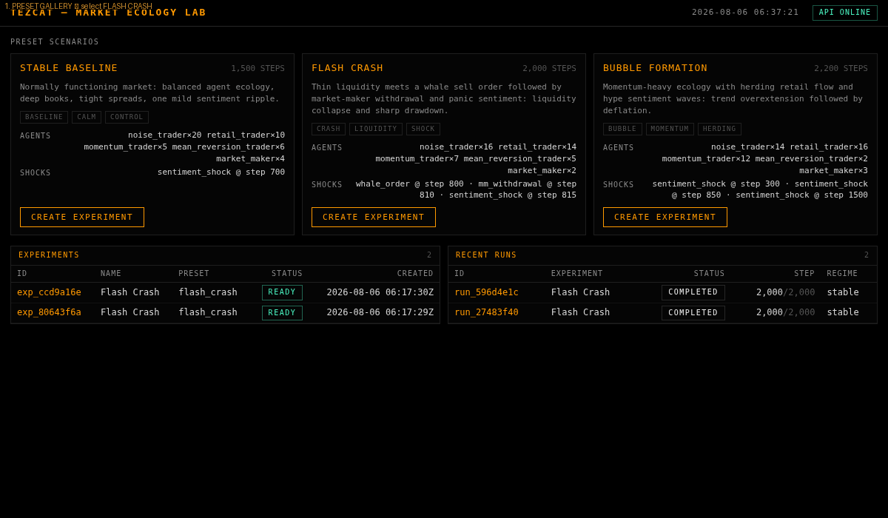
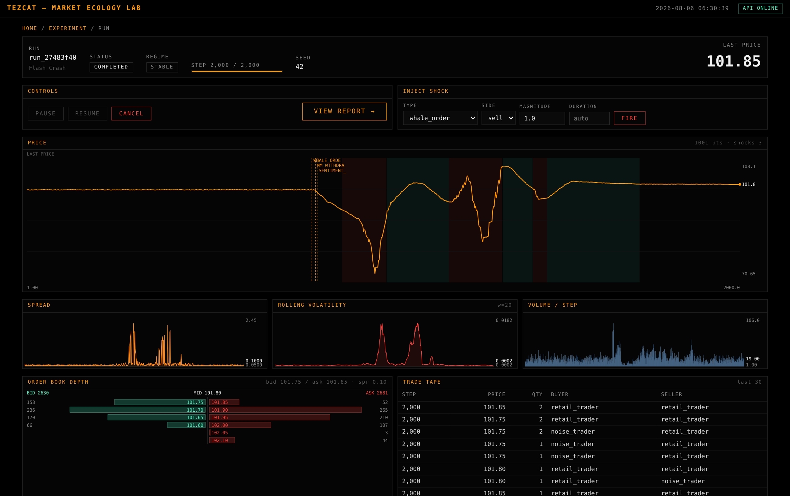
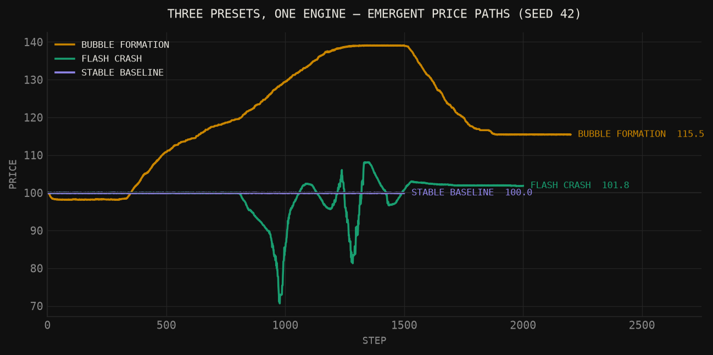
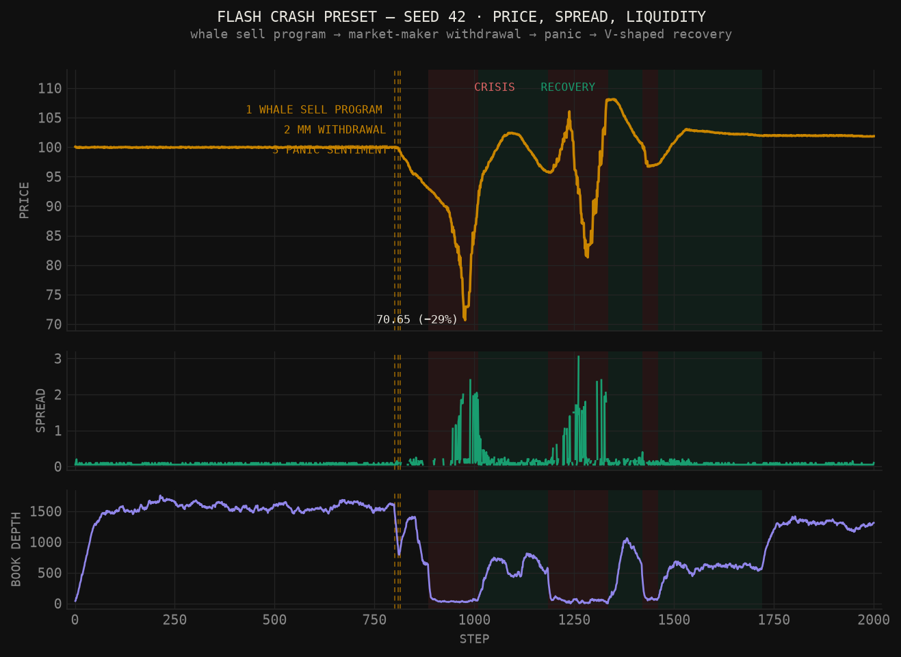
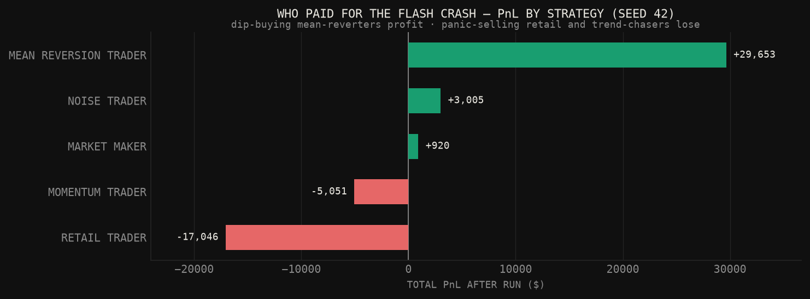
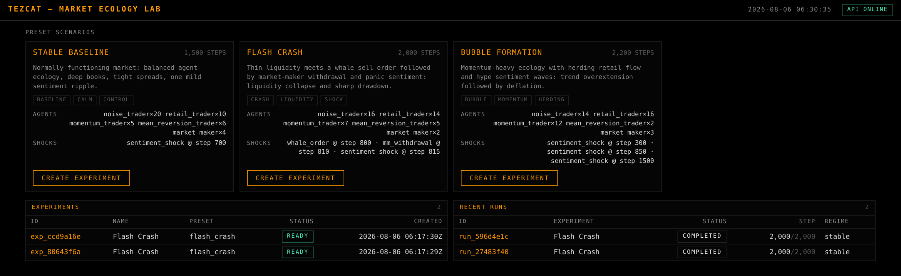
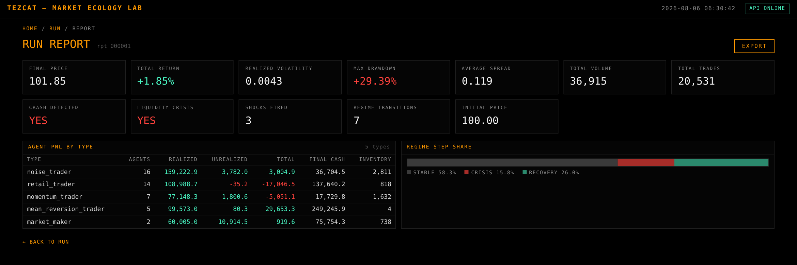
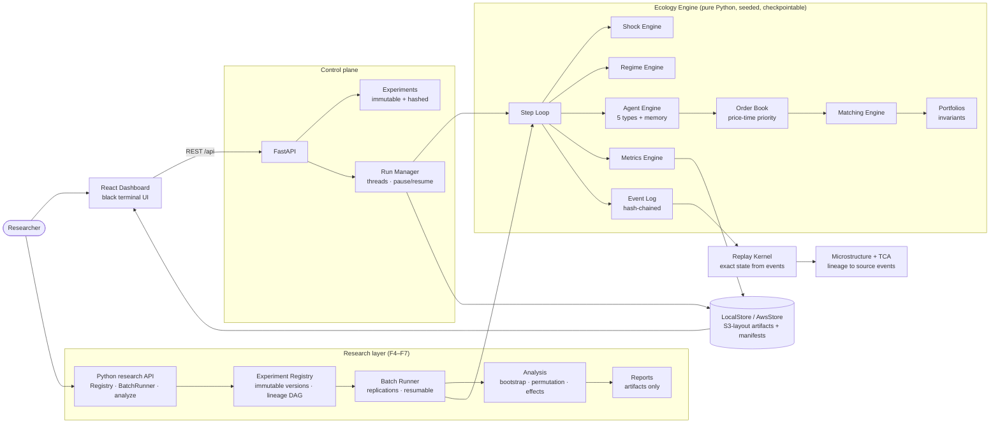

# Tezcat

> Financial markets are complex adaptive systems. **Tezcat** is a deterministic computational laboratory for exploring how simple trading behaviors combine to produce bubbles, crashes, liquidity crises, and recoveries — through controlled, reproducible experiments rather than historical prediction.

[](https://www.python.org/)
[]()
[](https://fastapi.tiangolo.com/)
[](https://react.dev/)
[](docs/reproducibility.md)
[](docs/deployment.md)
[](LICENSE)

Tezcat does not predict markets. It creates artificial markets populated by heterogeneous trading agents, then lets you run **controlled experiments** on how bubbles, crashes, liquidity crises, and recoveries *emerge* — price is never imposed externally; it arises from order flow through a real limit order book. Every run is bit-for-bit reproducible, every trade traces to a hash-chained event log, and every published number traces to a persisted artifact.

---

**Contents** · [Demo](#see-it-in-action) · [What's inside](#whats-inside) · [Quickstart](#quickstart) · [Run an experiment](#run-a-real-experiment-in-30-lines) · [Presets](#the-three-presets) · [API](#api) · [Architecture](#architecture) · [Public deployment](#public-deployment) · [Design rules](#critical-design-rules) · [Roadmap status](#implementation-status-vs-research-roadmap) · [Docs](#documentation-index)

---

## See it in action


*12-second walkthrough: select Flash Crash preset → run starts → whale order hits at step 800 → crisis regime → recovery → final report.*


*The live run dashboard: flash crash at step 800 (whale sell program → MM withdrawal → panic sentiment), regime bands, live order book ladder, trade tape, and a shock-injection panel.*

## What's inside

### The market

| Layer | What it does |
|---|---|
| **Market Engine** | Central limit order book, price-time priority matching, partial fills, tick-snapped prices, explicit [self-trade & duplicate-ID policies](docs/semantics.md) |
| **Agent Ecology** | 5 agent types: noise, retail (herding/panic), momentum, mean-reversion (fundamental anchor), market maker (inventory-skewed quotes) |
| **Portfolio Layer** | Reservation-based accounting: no negative cash/inventory; conservation and reservation-reconciliation invariants checked every run |
| **Shock Engine** | Whale order programs, market-maker withdrawal, sentiment shocks — scheduled or injected live via API |
| **Regime Engine** | Stable / Crisis / Recovery detection with hysteresis; regime modifiers change agent behavior |
| **Agent Memory** | Fear/confidence/trend/value beliefs update from experience; losses make agents cautious |

### The laboratory

| Layer | What it does |
|---|---|
| **Event Log** | Hash-chained canonical log of every order, trade, reservation, shock, and regime transition; [replay rebuilds exact market state from events alone](docs/events.md) |
| **Checkpoints & Forks** | Bit-identical restore mid-run; fork a market at any checkpoint with a declared intervention and full parent lineage |
| **Research Objects** | [Immutable, content-addressed experiment versions](docs/research_objects.md): validated designs (control/treatment, sweeps, factorials), ≥2 replications enforced, deterministic per-cell seeds |
| **Batch Runner** | Monte Carlo replications over design matrices — resumable, idempotent, budget-capped with explicit (never silent) truncation |
| **Analysis** | [Seeded bootstrap CIs, permutation tests, effect sizes, Holm correction, 2×2 interactions](docs/analysis.md); honest null results |
| **Reports** | Markdown reports rendered **exclusively from persisted artifacts** — a test proves rendered numbers equal independently recomputed values |
| **Microstructure & TCA** | [Microprice, queue imbalance, effective/realized spread, price impact, fill probability, implementation shortfall](docs/microstructure.md) — all with lineage to source events |
| **Risk Engine & Stress Lab** | [Margin buying, event-driven liquidation *process*, VaR/Expected Shortfall, pump-and-dump stress scenarios](docs/risk.md) — endogenous margin spirals, opt-in per experiment |
| **Stylized Facts & Calibration** | [Cont-style feature extraction, real-vs-synthetic ensemble comparison, budgeted grid calibration with *enforced* out-of-sample validation](docs/calibration.md) — file-based data lineage, fully offline |
| **Research CLI & API** | [`tezcat run / analyze / report / reproduce / list`](docs/cli.md) + the same loop under `/api/research` and a dashboard **RESEARCH** section — the complete loop with zero knowledge of internals |
| **Parallel & Hardened** | [`--workers N` process-pool replications (byte-identical for any worker count), fault-injection-tested storage, differential reference matcher, environment-aware benchmarks](docs/benchmarks.md) |
| **REST API + Dashboard** | FastAPI control plane; minimalist Bloomberg-style black terminal UI (React + custom SVG charts) |
| **Cloud (optional)** | S3-layout artifact store, DynamoDB adapters, SAM template; everything runs fully local without AWS |

## Quickstart

```bash
python3 -m venv .venv && .venv/bin/pip install -e ".[dev]"
cd frontend && npm install && npm run build && cd ..
.venv/bin/uvicorn tezcat.api.app:app --host 0.0.0.0 --port 8000
# open http://localhost:8000
```

```bash
.venv/bin/python scripts/smoke.py      # headless run of all three presets + determinism gate
.venv/bin/python -m pytest tests -q    # tests: unit, property, determinism, replay, integration
```

### The five-command research loop

```bash
tezcat run examples/margin_spiral_ab.json   # register + execute 40 runs (~30s)
tezcat analyze expv_417305c181af            # bootstrap CIs, permutation p, effect sizes
tezcat report  expv_417305c181af -o report.md
tezcat reproduce 417305c1                   # re-execute + verify every stored hash
tezcat list
```

`reproduce` takes the research hash you'd cite in a paper (any unambiguous
prefix) and verifies state hashes, event hashes, event-log chains, and
metrics byte-for-byte against the stored artifacts — a single falsified
number makes it fail. Full guide: [docs/cli.md](docs/cli.md).

## Run a real experiment in 30 lines

The signature workflow — hypothesis → validated design → replications → inference → report — with nothing hand-waved:

```python
from tezcat.core.config import AgentGroupConfig, AgentType, ExperimentConfig
from tezcat.experiments.schema import Arm, DesignSpec, ExperimentVersion
from tezcat.experiments.registry import Registry
from tezcat.experiments.batch import BatchRunner
from tezcat.analysis import analyze, build_report

config = ExperimentConfig(
    agents=[AgentGroupConfig(agent_type=AgentType.NOISE_TRADER, count=12),
            AgentGroupConfig(agent_type=AgentType.RETAIL_TRADER, count=10,
                             params={"herding": 0.5}),
            AgentGroupConfig(agent_type=AgentType.MARKET_MAKER, count=3)],
    total_steps=500)

design = DesignSpec(
    design_type="ab",
    question="Does retail herding increase crash severity?",
    hypothesis="Higher herding raises max drawdown at fixed liquidity.",
    independent_variables=["agents.1.params.herding"],
    dependent_variables=["max_drawdown", "total_return"],
    primary_metric="max_drawdown",
    control=Arm(name="low",  overrides={"agents.1.params.herding": 0.2}),
    treatments=[Arm(name="high", overrides={"agents.1.params.herding": 0.8})],
    replications=50)                       # replications=1 is rejected: one seed is not evidence

registry = Registry("data")
vid = registry.register(ExperimentVersion("exp_herding", "herding-ab", config, design))
BatchRunner(registry).run(vid)             # 100 runs, deterministic seeds, resumable
analysis = analyze(registry, vid, seed=0)  # bootstrap CIs, permutation p, effect sizes
print(build_report(registry, vid))         # markdown rendered from artifacts only
```

The design is validated *before* anything runs (missing control, too few replications, budget overruns, and typo'd parameter paths are all rejected). The batch is content-addressed — re-running resumes; nothing is recomputed or silently dropped.

## The three presets

| Preset | What happens |
|---|---|
| **Stable Baseline** | Balanced ecology. Tight spread, low volatility — the control group. |
| **Flash Crash** | At step 800 a whale sell program hits a thin book; market makers withdraw; sentiment turns; retail panics. ~30% drawdown, crisis regime, then a V-shaped recovery as mean-reversion capital buys the dip. |
| **Bubble Formation** | Hype sentiment waves + momentum-heavy ecology push price ~+40%; a reality check deflates it. Momentum/retail profit on the way up, market makers bleed. |

Same seed + same config ⇒ identical run — same trades, same event chain, same artifact hashes. All figures below are generated from real deterministic runs by `scripts/make_figures.py`:



### Anatomy of the flash crash

Price, spread, and book depth around the shock chain — regime detection (crisis bands in red, recovery in green) reacts purely to emergent market stress:



### Who paid for it

The report attributes PnL by strategy. Panic-selling retail transfers wealth to the mean-reversion traders who bought the dislocation — and the F7 TCA layer shows the *cost* side: during the crash, liquidity providers earn a **negative** realized spread (they get run over), while price impact accounts for the difference:



## Try the demo (2 minutes)

1. Open the dashboard → pick **Flash Crash** → CREATE EXPERIMENT → START RUN.

   

2. Watch price, spread, book depth. At step ~800 the whale hits: depth collapses, spread blows out, regime flips to **CRISIS**.
3. Inject your own shock live from the run page (e.g. another `whale_order`, sell, magnitude 2000).
4. Wait for recovery, then open the **report**: max drawdown, crash detected, PnL by agent type.

   

## API

Full contract in [`docs/api.md`](docs/api.md). Highlights:

```
GET  /api/presets                            POST /api/presets/{id}/experiments
POST /api/experiments                        POST /api/experiments/{id}/runs
GET  /api/runs/{id}         (pause/resume/cancel)
POST /api/runs/{id}/shocks   ← inject shocks into a live market
GET  /api/runs/{id}/market | history | trades | metrics | shocks | regimes | report
POST /api/runs/{id}/export
```

Completed runs persist a `manifest.json` with per-artifact SHA-256 checksums plus schema/code/config/seed/state/event provenance, and an `events/events.json` artifact carrying the full hash-chained event log.

## Architecture



## Repository layout

```
tezcat/
├── core/                # frozen pydantic config + hashing, seed derivation, state hash
├── market/              # order book + matching engine (event-emitting)
├── agents/              # portfolio invariants, base contract, 5 agent types
├── memory/              # adaptive agent memory (fear, confidence, beliefs)
├── shocks/  regimes/  metrics/
├── engine/ecology.py    # the step loop + checkpoint/restore/fork
├── events/              # hash-chained event log + replay kernel
├── checkpoints/         # checkpoint identity + fork lineage
├── experiments/         # research objects: schema, registry, batch runner, aggregation
├── analysis/            # bootstrap/permutation stats, design-aware inference, reports
├── microstructure/      # microprice, spreads, impact, queue, fills, TCA
├── risk/                # margin engine, liquidation process, VaR/ES, stress scenarios
├── data/  calibration/  # file-based series providers; budgeted out-of-sample calibration
├── persistence/         # local JSON store + AWS (DynamoDB/S3) store
├── cli.py               # tezcat run / analyze / report / reproduce / list
└── api/                 # FastAPI app, run manager, Lambda handlers, research API
frontend/                # React dashboard (Vite, custom SVG charts)
examples/                # ready-to-run experiment specs (margin spiral AB)
infra/                   # AWS SAM template + parked CI workflow (infra/ci/)
tests/                   # 208 tests: unit / property / determinism / replay / differential / fault
```

## Public deployment

The live free public demo is available at [satvikndxd.github.io/Tezcat](https://satvikndxd.github.io/Tezcat/), with the research workflow at [#/research](https://satvikndxd.github.io/Tezcat/#/research). Its separate FastAPI backend is [tezcat-public-api.onrender.com](https://tezcat-public-api.onrender.com). The deployment architecture, environment variables, free-tier limitations, persistence behavior, redeploy procedure, shutdown steps, and validation record are documented in [`docs/public-demo.md`](docs/public-demo.md).

## Cloud deployment (AWS)

Local-first: everything runs without AWS. To deploy, see [`docs/deployment.md`](docs/deployment.md) — `infra/templates/template.yaml` provisions API Gateway + control Lambda, a chunked worker Lambda triggered by EventBridge, DynamoDB tables, a private S3 artifact bucket, and CloudWatch alarms. Set `TEZCAT_STORE=aws` to switch persistence.

## Critical design rules

1. **Determinism first** — every random draw uses seeded, versioned generators; same identity ⇒ same event chain, state hash, and artifacts, verified across fresh processes.
2. **Config is immutable** — experiment configs are frozen and hashed; a stale hash refuses to run. Changing parameters means a new experiment version.
3. **Economic invariants** — cash & assets are conserved; reservations reconcile exactly to resting orders; verified by `check_invariants()` and randomized property tests.
4. **Events, not just state** — every order, trade, reservation, shock, and regime transition is in the hash-chained log; replay reconstructs the exact market, and metrics carry lineage to source events.
5. **One seed is not evidence** — comparative designs require replications; analyses carry uncertainty; reports render from artifacts only and state what the model does *not* support.
6. **Engines are independent** — the core engine has zero AWS/HTTP dependencies; cloud is an optional adapter, never a semantic layer.

## Implementation status vs. research roadmap

Tezcat is being hardened from an MVP artificial-market laboratory into a research-grade platform in gated, evidence-first phases. Each phase ships with tests, documentation, and a preserved baseline (the frozen seed-42 smoke figures have remained byte-identical through every phase).

| Phase | Capability | Status | Contract |
|---|---|---|---|
| F0 | Audited baseline freeze | ✅ | [docs/audit/F0_baseline.md](docs/audit/F0_baseline.md) |
| F1 | Financial semantics (STP, duplicate IDs, precision, reservation laws) | ✅ | [docs/semantics.md](docs/semantics.md) |
| F2 | Deterministic identity, seed derivation, provenance manifests | ✅ | [docs/reproducibility.md](docs/reproducibility.md) |
| F3 | Event sourcing, replay, checkpoints, forks | ✅ | [docs/events.md](docs/events.md) |
| F4 | Research objects: validated designs, immutable versions, lineage registry | ✅ | [docs/research_objects.md](docs/research_objects.md) |
| F5 | Monte Carlo replications, sweeps, factorials — resumable batches | ✅ | [docs/research_objects.md](docs/research_objects.md) |
| F6 | Statistical inference + artifact-only reports | ✅ | [docs/analysis.md](docs/analysis.md) |
| F7 | Microstructure & TCA with event lineage | ✅ | [docs/microstructure.md](docs/microstructure.md) |
| F8 | Leverage, margin, liquidation, Stress Lab | ✅ | [docs/risk.md](docs/risk.md) |
| F9 | Stylized facts, data providers, calibration discipline | ✅ | [docs/calibration.md](docs/calibration.md) |
| F10 | Research CLI, research API, dashboard research section | ✅ | [docs/cli.md](docs/cli.md) |
| F11 | Parallel workers, fault injection, differential matcher, benchmarks | ✅ | [docs/benchmarks.md](docs/benchmarks.md) |

Not yet implemented (target roadmap, not current facts): licensed real-market data ingestion (the file provider and calibration discipline exist; no real dataset or network adapter ships), multi-machine distributed execution (single-machine parallel workers exist), latency modeling, funding-network contagion. Single-seed preset outputs are demonstrations, not evidence.

## Documentation index

| Document | What it covers |
|---|---|
| [docs/semantics.md](docs/semantics.md) | Order lifecycle, validation, reservations, self-trade policy, conservation laws, monetary precision |
| [docs/reproducibility.md](docs/reproducibility.md) | The identity tuple, hash comparison order, what is and isn't guaranteed |
| [docs/events.md](docs/events.md) | Event schema, replay semantics, checkpoint compatibility, fork lineage, measured costs |
| [docs/research_objects.md](docs/research_objects.md) | Experiment versions, design validation, deterministic seeds, batch/aggregation semantics |
| [docs/analysis.md](docs/analysis.md) | Statistical methods, assumptions, policies, honest-null acceptance evidence |
| [docs/microstructure.md](docs/microstructure.md) | Metric definitions, units, edge cases, TCA decomposition, QI association caveats |
| [docs/risk.md](docs/risk.md) | Margin model, liquidation process, tail metrics, Stress Lab, acceptance evidence |
| [docs/calibration.md](docs/calibration.md) | Data lineage, stylized-facts features, ensemble comparison, calibration discipline, identifiability findings |
| [docs/cli.md](docs/cli.md) | The researcher guide: five commands, spec format, research API, worked example |
| [docs/benchmarks.md](docs/benchmarks.md) | Benchmark protocol, parallel-worker correctness, fault-injection findings, differential matcher |
| [docs/api.md](docs/api.md) · [docs/architecture.md](docs/architecture.md) · [docs/deployment.md](docs/deployment.md) | REST contract, system architecture, AWS deployment |
| [docs/public-demo.md](docs/public-demo.md) | GitHub Pages + Render public demo deployment, limits, persistence, CI/CD, validation |
| [docs/audit/F0_baseline.md](docs/audit/F0_baseline.md) | The frozen pre-hardening baseline and audit trail |
