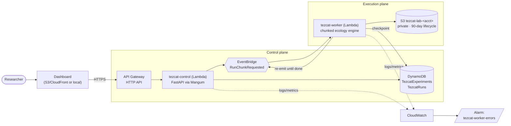
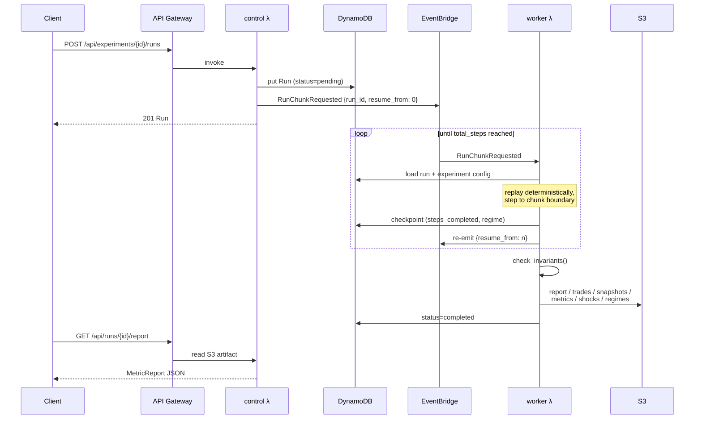

# AWS Deployment Guide

Tezcat is **local-first** — everything in the README runs without AWS. This guide
deploys the same engine to a serverless AWS stack defined in
[`infra/templates/template.yaml`](../infra/templates/template.yaml).

## Target architecture



## Run execution flow

Lambda has a hard timeout, so a run executes as a chain of **chunks**. The engine
is deterministic and fast (~2k steps/sec), so each chunk cheaply replays from
step 0 to its resume point — no state serialization needed:



## What gets provisioned

| Resource | Name | Purpose | Cost profile |
|---|---|---|---|
| HTTP API | (stack output) | REST entry point | pay per request |
| Lambda | `tezcat-control` | FastAPI control plane (Mangum) | free tier: 1M req/mo |
| Lambda | `tezcat-worker` | chunked simulation execution | 2048 MB, 600 s timeout |
| DynamoDB | `TezcatExperiments`, `TezcatRuns` | metadata only (never step data) | on-demand, pennies |
| S3 | `tezcat-lab-<account-id>` | all step-level artifacts | private, 90-day expiry |
| EventBridge | default bus | `RunChunkRequested` chaining | negligible |
| CloudWatch | log groups + `tezcat-worker-errors` alarm | observability | limit retention |

## Deploy

```bash
pip install aws-sam-cli
pip install mangum boto3          # extra deps for the Lambda handlers
cd infra/templates
sam build
sam deploy --guided --stack-name tezcat
```

`sam deploy --guided` asks for region and confirms IAM role creation (the template
uses scoped SAM policy templates — DynamoDB CRUD and S3 CRUD per resource, plus
`events:PutEvents`; no wildcard admin).

## Environment variables

| Var | Where | Meaning |
|---|---|---|
| `TEZCAT_STORE` | both λ | `aws` in Lambda, `local` for dev |
| `TEZCAT_S3_BUCKET` | both λ | artifact bucket (set by the template) |
| `TEZCAT_TABLE_EXPERIMENTS` / `TEZCAT_TABLE_RUNS` | both λ | DynamoDB tables |
| `TEZCAT_CHUNK_STEPS` | worker | steps per invocation (default 5000) |

## S3 artifact layout

Identical to the local `data/artifacts/` tree, so local and cloud results are
interchangeable:

```text
tezcat-lab-<account>/
└── experiments/{experiment_id}/
    ├── config/config.json
    └── runs/{run_id}/
        ├── trades/trades.json
        ├── snapshots/snapshots.json
        ├── metrics/step_metrics.json
        ├── shocks/shock_events.json
        ├── regimes/regime_events.json
        ├── report/report.json
        └── export/manifest.json        # written by POST /runs/{id}/export
```

## Smoke-test the deployment

```bash
API=$(aws cloudformation describe-stacks --stack-name tezcat \
      --query 'Stacks[0].Outputs[?OutputKey==`ApiUrl`].OutputValue' --output text)

# 1. create an experiment from a preset
EXP=$(curl -s -X POST $API/api/presets/flash_crash/experiments -d '{}' \
      -H 'content-type: application/json' | jq -r .experiment_id)

# 2. start a run (the worker chain takes over)
RUN=$(curl -s -X POST $API/api/experiments/$EXP/runs -d '{}' \
      -H 'content-type: application/json' | jq -r .run_id)

# 3. poll until completed
watch -n 2 "curl -s $API/api/runs/$RUN | jq '{status, steps_completed}'"

# 4. fetch the report
curl -s $API/api/runs/$RUN/report | jq
```

A successful flash-crash run reports the same numbers you get locally
(determinism is seed-based, not machine-based) — this is the report the
dashboard renders:


Expected key values for `seed=42`:

```json
{
  "final_price": 101.85,
  "max_drawdown": 0.293853,
  "crash_detected": true,
  "liquidity_crisis_detected": true,
  "shock_count": 3,
  "regime_transition_count": 7
}
```

## Post-deploy checklist

- [ ] **Billing alarm**: AWS Budgets → zero-spend or $5 budget alert
- [ ] **Bucket privacy**: `aws s3api get-public-access-block --bucket tezcat-lab-<acct>` → all four `true`
- [ ] **Worker chain**: run the smoke test above; confirm `report/report.json` lands in S3
- [ ] **Logs**: CloudWatch → `/aws/lambda/tezcat-control` and `/aws/lambda/tezcat-worker`
- [ ] **Alarm**: `tezcat-worker-errors` in OK state
- [ ] **Signed downloads**: `AwsStore.presigned_url(prefix, "report/report.json")` returns a working time-limited URL
- [ ] **Failed-run handling**: kill a worker mid-chain (throttle concurrency to 0), confirm the run is marked `failed`/recoverable
- [ ] **Log retention**: set both log groups to 14–30 days

## Cost controls

- Step-level data goes to **S3, never DynamoDB** (a 2,000-step run is ~1 MB of JSON; the DynamoDB rows are <2 KB).
- On-demand billing everywhere; an idle stack costs ~$0.
- S3 lifecycle expires artifacts after 90 days (tune in the template).
- `TEZCAT_CHUNK_STEPS` trades invocation count against invocation duration — 5000 steps ≈ 3–5 s of compute, far below the 600 s timeout.
